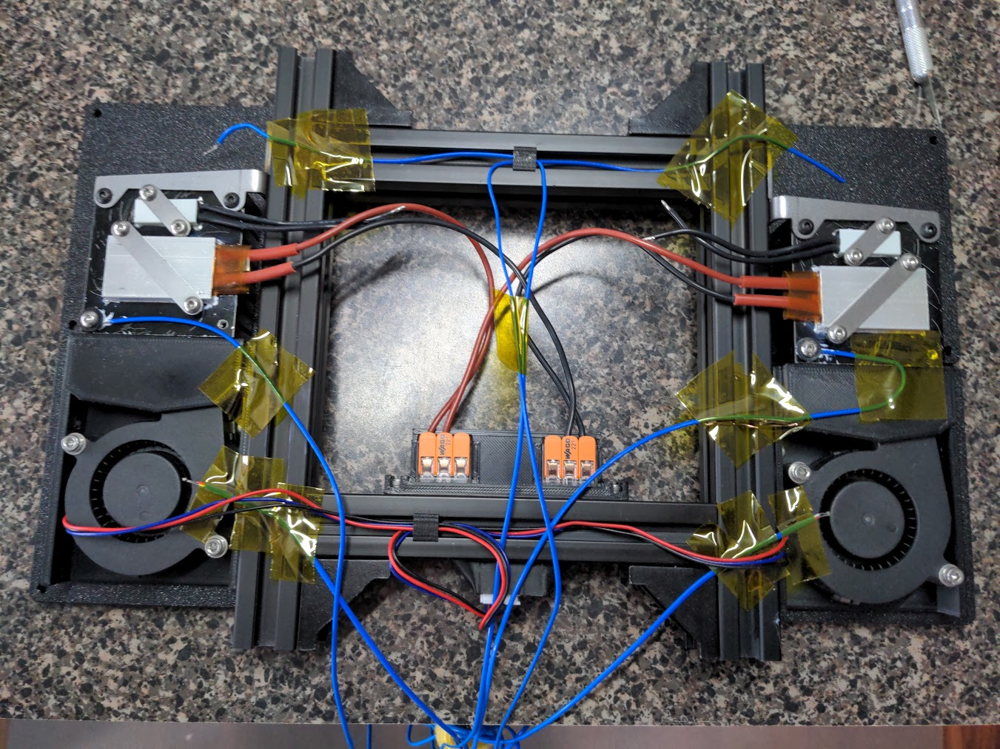
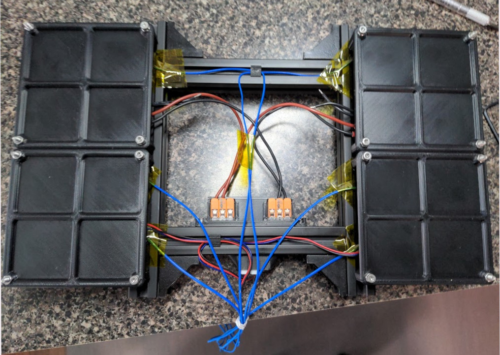

# PTC Heated bed fans mod for Voron 2.4 Printers
Installed on Voron 2.4 bed rails. 

Can be placed on the outside, center or both.

Outer placement will be covered by the bed for 300 and 350 size but exposed on 250 size.

Mods that lift the bed such as Whoppingpochard kinematic bed mount are highly recommended 
to increase air flow and prevent damage to the bed heater.

## Es ist "verboten"

:fire: :fire: :fire:

Installation of this mod involves wiring mains AC voltage and addition of heaters without thermistor feedback. 

Careful wiring and component selection can reduce the risk of injury or fire, 
but only similar to the existing components of a v2.4 but never zero.

This mod should not be attempted without experience and caution.

:fire: :fire: :fire:

**Do NOT ask about this mod in the Voron Design Discord.**

---

## Design
* Designed to be relatively

### Results
* A twin bedburner test rig setup
  
  
  * Thermocouples were placed at the fan intake, on the block surface and at the block exhaust
  * Combined amperage was measured and recorded along with temperature readings
  * was inside an thinly insulated box with a simulated V2.4 configuration
  * Heaters output over 70 watts each at 25C ambient
  * Output dropped to roughly 60 watts each at 75C ambient
* Twin bedburner setup installed in a v2.4 300
  
  * Stock panels and doors, stock exhaust, no blanket or insulation
  * Nevermore micro v6 recirculating and exaust fan off
  * Heatsoaking bed at 105C and 100% bedburner
  * Chamber temperature reached stable 65C

---

## Parts List
* 
