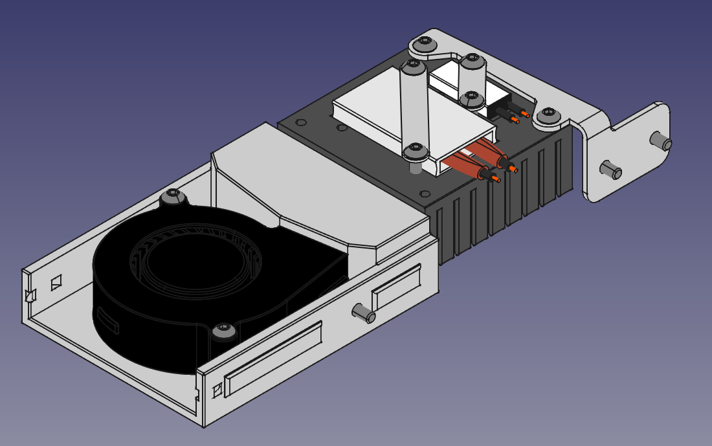
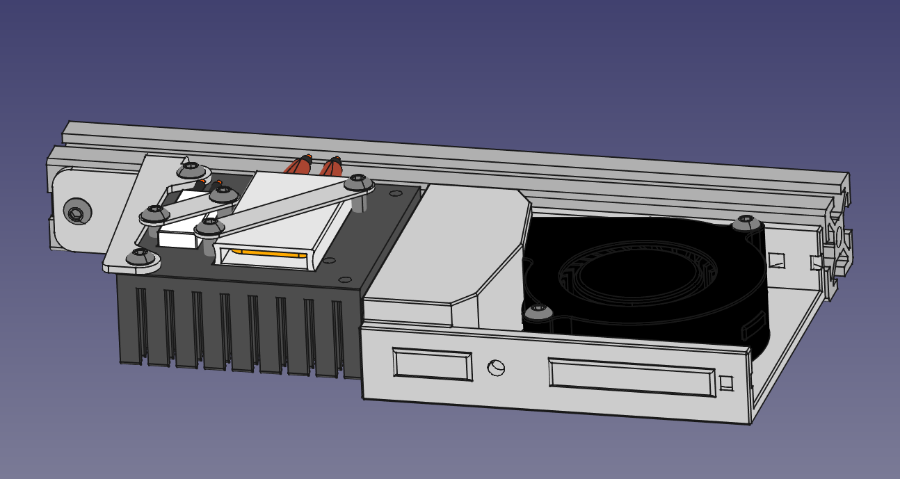
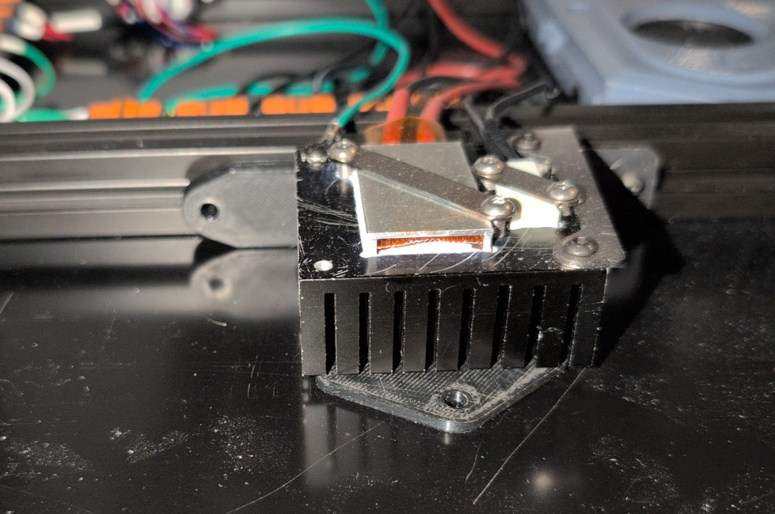

# BedBurner Assembly Instructions

## CAD Reference

## Wiring Disclaimer

This document will not go into wiring details because that is a topic I don't
feel comfortable speaking to. I will just repeat some general 3D printer
electrical safety recommendations.
 * Make sure mains components are fuse protected and properly grounded.
 * Any heater, including PTC heaters, should have some thermal protection
such as a thermal switch, thermal fuse or thermistor under firmware control.
 * You should know the current draw of components being used and plan accordingly.
 * Adequate thickness wire should be used for the expected current and temperature.

## Heater Heatsink

Steps will vary slightly based on choice of components.
1. Place PTC heater into large heatsink pocket.
   * add temperature rated thermal grease if desired.
2. Place PTC strap diagonally across the PTC and secure with two M3 x 8mm screws.
3. Install thermal safefy component.
    * Thermal Switch / Thermal Fuse:
      1. Place thermal switch body into the smaller heatsink pocket
          * recommended to orient wires facing the same side as the PTC heater
          * add temperature rated thermal grease if desired.
      2. Place thermal switch strap diagonally across the thermal switch and secure with two M3 x 8mm screws.
    * Thermal Fuse:
      1. Place thermal switch body into the smaller heatsink pocket
          * recommended to orient wires facing the same side as the PTC heater
          * add temperature rated thermal grease if desired.
      2. Secure thermal fuse to heatsink with one M3 x 8mm screw through mouting hole
    * Thermistor:
      1. Thread Thermistor into any unused threaded holes in the heatsink.
          * recommended to use central but accessible holes like those for thermal fuse mounting.

## Fan Duct

1. Press short M3 heatset inserts for fan mounting into holes printed part
2. Attach the 5015 blower fan to the duct base using M3 x 18mm screws
3. Secure fan wire using a cable tie on one side of the fan duct
   * use the side that makes sense for cable management when it is installed.
   * you will probably want to make mirrored pairs.

## Installation

1. Loosely attach Heatsink Bracket(s) to bed frame extrusion using two M3 x 6mm screws and two tnuts each
   * if using roll-in tnuts they should face orient so they do not interfere.
   * pay attention to which bracket you are using because it will decide the direction of airflow.
   * rear style bracket screws can be loosened and slid into final position later.
   * front type bracket screws can not be accessed later so position will be final.
2. Loosely attach heatsink unit to bracket(s) with M3 x 4mm screws.
   * heatsink fins should be oriented parallel to extrusion.
   * hole tolerance is generous to allow for fabrication inaccuracies.
   * use [printed spacers](/STL/tools) space block properly off deck and extrusion.
   
3. Tighten screws to secure heatsink into position.
4. Loosely attach Fan Duct to bed frame extrusion using one M3 x 6mm screw and tnuts.
   * Duct opening should face toward the heatsink.
   * You may find it easier to reach the screw by temporarily detaching the 5015 fan.
5. Slide Fan Duct until there is a small gap between heatsink then tighten to secure.
